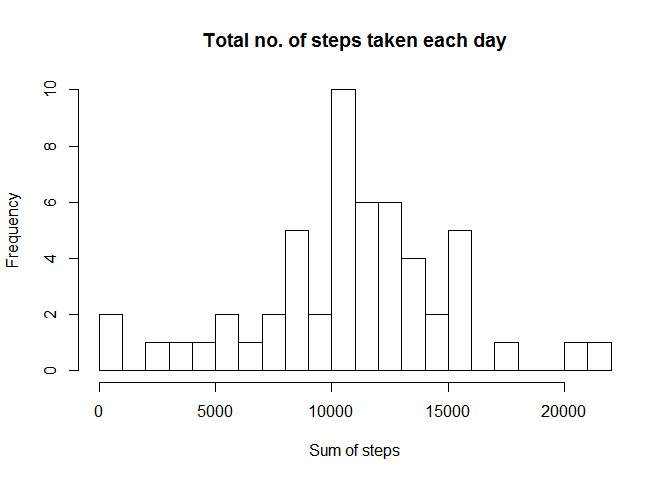
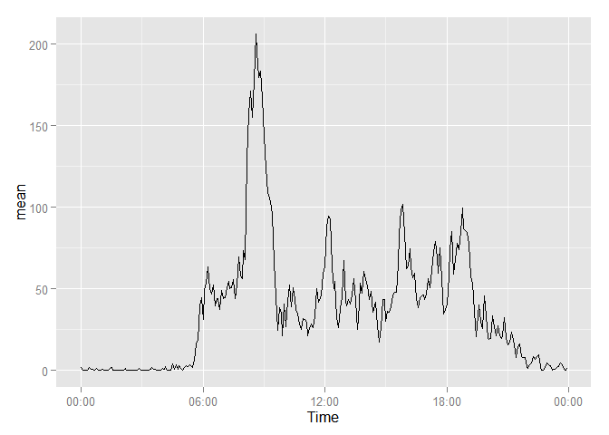

# Reproducible Research: Peer Assessment 1


## Loading and preprocessing the data


```r
download.file("http://d396qusza40orc.cloudfront.net/repdata/data/activity.zip", "activity.zip")
unzip("activity.zip", exdir = "activity")
activity<-read.csv("activity/activity.csv")
```

## What is mean total number of steps taken per day?


```r
library(plyr)

steps_select<-subset(activity,select=c(date,steps))
steps_clean<-na.omit(steps_select)
steps_total<-ddply(steps_clean,"date", summarise, total=sum(steps))
hist(steps_total$total,breaks=30,
     main='Total no. of steps taken each day',
     xlab='Sum of steps'
     )
```

 

```r
steps_mean<-mean(steps_clean$steps)
steps_median<-median(steps_clean$steps)
steps_mean
```

```
## [1] 37.3826
```

```r
steps_median
```

```
## [1] 0
```

## What is the average daily activity pattern?


```r
steps_select2<-subset(activity,select=c(interval,steps))
steps_clean2<-na.omit(steps_select2)
steps_mean2<-ddply(steps_clean2,"interval", summarise, mean=mean(steps))
plot(steps_mean2$interval,steps_mean2$mean,type="l",
     main='Time series plot of steps taken by 5-minute interval',
     xlab='5-minute interval',
     ylab='No. of steps averaged across all days')
```

 

```r
steps_max<-subset(steps_mean2,mean==max(mean))
steps_max
```

```
##     interval     mean
## 104      835 206.1698
```


## Imputing missing values


```r
sum(is.na(activity$steps))
```

```
## [1] 2304
```

```r
set_to_zero<-activity
set_to_zero[is.na(set_to_zero)]<-0
steps_mean_day<-ddply(set_to_zero,"date", summarise, mean=mean(steps))
combined<-merge(steps_mean_day,activity,by="date")
combined$new <- ifelse(is.na(combined$steps), combined$mean, combined$steps)
steps_total_new<-ddply(combined,"date", summarise, total=sum(new))
hist(steps_total_new$total,breaks=30,
    main='Total no. of steps taken each day_imputed missing',
    xlab='Sum of steps')
```

 

```r
steps_mean_new<-mean(combined$new)
steps_median_new<-median(combined$new)
steps_mean_new
```

```
## [1] 32.47996
```

```r
steps_median_new
```

```
## [1] 0
```

```r
# The histogram now reflects that in fact, one of the highest frequencies in a day is where one does not take any steps at certain times of the day. This also brought down the average no. of steps taken per day.
```

## Are there differences in activity patterns between weekdays and weekends?


```r
library(ggplot2)
```

```
## Warning: package 'ggplot2' was built under R version 3.1.3
```

```r
library(reshape2)
```

```
## Warning: package 'reshape2' was built under R version 3.1.3
```

```r
combined$days<-weekdays(as.Date(combined$date))
combined$days_label<-ifelse(combined$days=="Saturday"|combined$days=="Sunday",
                            "Weekend","Weekday")
steps_combined<-ddply(combined,c("days_label","interval"), summarise, mean=mean(new))
lc<-ggplot(steps_combined,aes(x=interval, y=mean, group=1))+geom_line()
lc+facet_grid(days_label~.)
```

 

```r
#Generally less steps were taken on weekend than on weekdays and steps taken on weekends do not vary as much as on weekedays.
```

